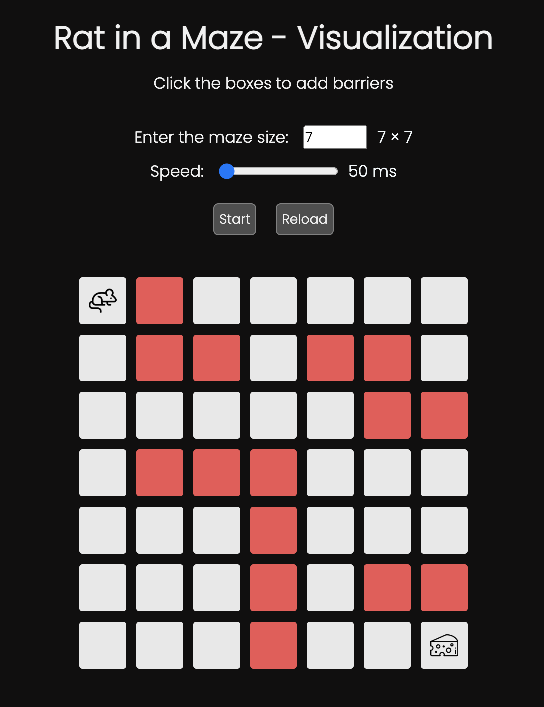
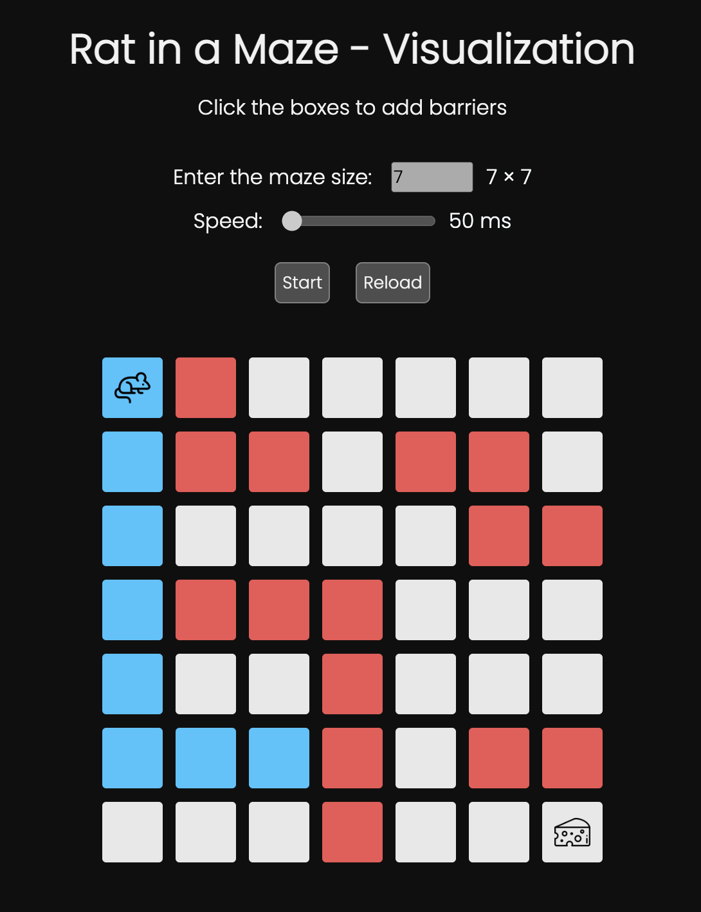
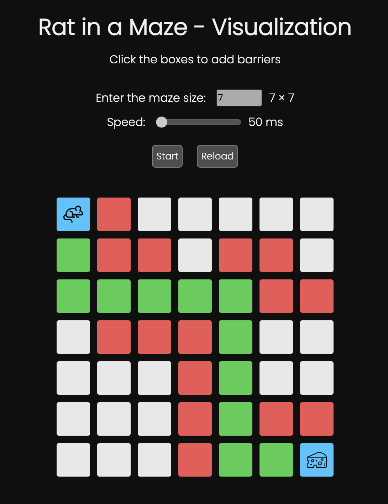

# React - Rat in a maze visualization

Check out the link in the repository details to view the application

## About the algorithm

The rat in a maze is a very famous algorithm where you have a rat at some position in a grid and this rat is supposed to get to a cheese block.

The algorithm uses backtracking to avoid paths that would not lead to the destination.

This algorithm is built in way that the rat can only make new moves in only _down_ and _right_ directions.

## About the project

In this application, you can use various grid sizes and also adjust the visualization speed.
You first set the grid size and set the visualization speed.
After which you click on the boxes to add them as barriers for the rat. Then click on the start button to start the visualization.

## Output

### Here are some snapshots from the visualization:

1: Barriers set and algorithm to be started

 

2: Halfway of the algorithm running

 

3: The end result

## Other links

Click [here](https://prtvi.github.io/allprojects.html) to check out my other projects
